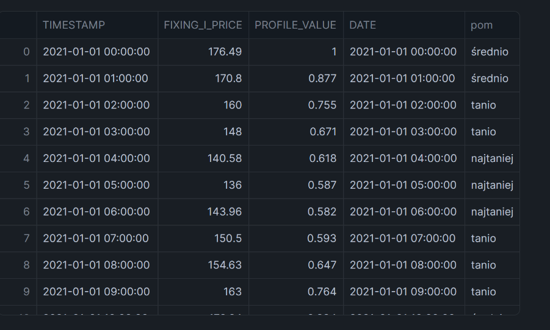
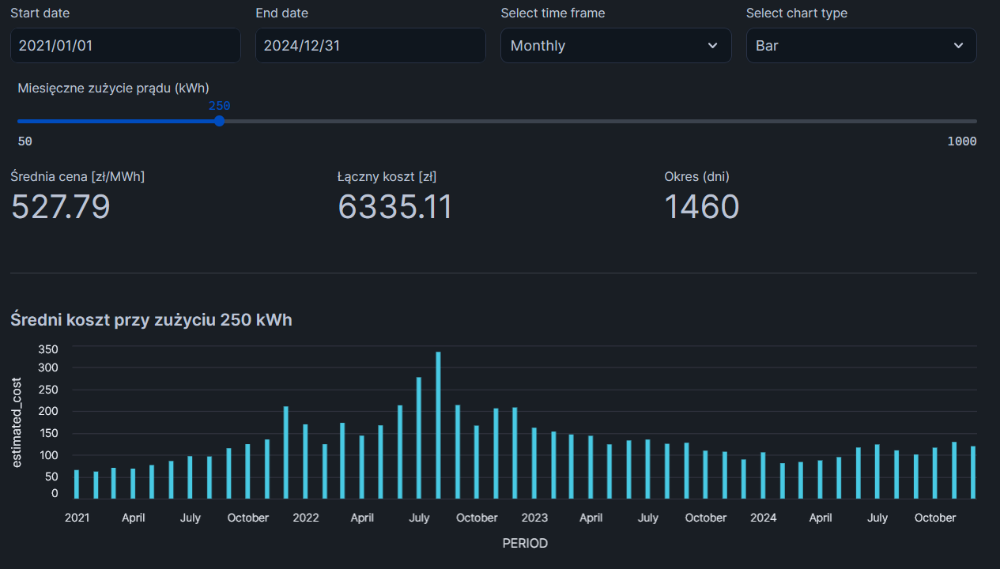
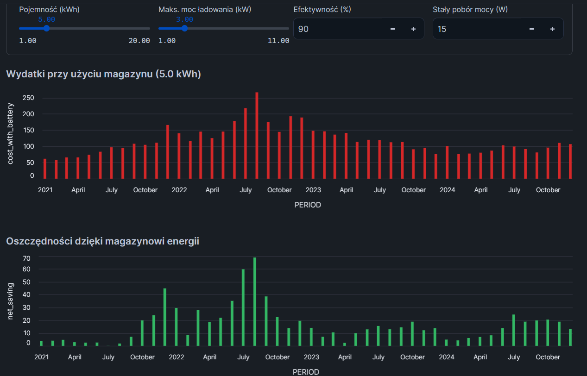
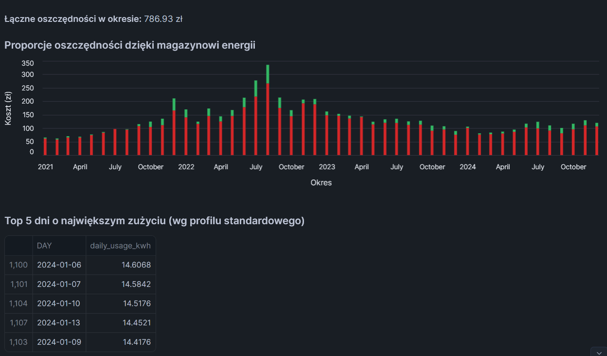

# Projekt: "snowflake-electricity-prices-analysis" - Jakub Miszczak
### Analiza cen prądu oraz sensu wprowadzania magazynów energii przy użyciu technologii Snowflake, Python - (streamlit, pandas, numpy), SQL.

> ** Uwaga techniczna:** Plik `.ipynb` zawarty w tym repozytorium zawiera surowy kod źródłowy opracowany bezpośrednio w środowisku Snowflake Notebooks. Ze względu na wykorzystanie natywnych funkcji Snowflake (np. get_active_session()) udostępniony kod służy wyłącznie do celów prezentacyjnych i dokumentacyjnych, w każdym momencie może zostać on udostępniony na platformie Snowflake. Pełne działanie interaktywne zostało opisane poniżej i przedstawione na poniższych zrzutach ekranu.

Głównym zadaniem projektu było stworzenie projektu interaktywnej aplikacji analitycznej przeznaczonej zgodnie z następującymi User Stories:
* US1: Jako osoba zainteresowana przejściem na taryfy dynamiczne chcę sprawdzić, ile zapłaciłbym miesięcznie za prąd (przy zadanym zużyciu miesięcznym (np. 200kWh)) uwzględniając historyczne ceny energii w TGE. 
* US2: Jako osoba zainteresowana przejściem na taryfy dynamiczne chcę sprawdzić, jak zamontowanie magazynu energii wpłynie na moje rachunki za prąd. Magazyn ma swoje parametry: pojemność (1-20kWh), maksymalny prąd ładowania (1-11kW), efektywność baterii (90%), stały pobór prądu (15W). 
* US3: Jako sprzedawca magazynów energii chcę móc policzyć klientowi optymalny rozmiar magazynu, jaki w oparciu o dane historyczne pozwoli mu zminimalizować koszty energii.

## Technologie:
* **Platforma:** Snowflake (Notebooks, Streamlit apps)
* **Język:** SQL, Python (pandas, numpy, streamlit, altair)

## Dane:

Fundamentem aplikacji są dane rynkowe i ustandaryzowane profile konsumenckie zużycia prądu:
1. **Historyczne ceny prądu:** [Instrat](https://energy.instrat.pl/ceny/energia-rdn-godzinowe/).
2. **Profil standardowy zużycia energii:** [Stoen](https://www.stoen.pl/)

Dane zostały pobrane do Snowflake i odpowiednio sformatowane w celu łatwiejszego zarządzania.
W ostatecznym podejściu każda godzina jest oceniana w kontekście lokalnego okna czasowego (24 godziny w przód i w tył). Na podstawie obliczonych kwantyli (10%, 25%, 75%) dla tego okna, algorytm przypisuje cenie w danej godzinie etykietę: `"najtaniej"`, `"tanio"`, `"średnio"` lub `"drogo"` i na tej podstawie system wie, kiedy optymalnie ładować a kiedy korzystać ze zgromadzonej w magazynie energii.

Poniżej znajduje się podgląd przetworzonej tabeli na podstawie której działa cała logika aplikacji (wywołanie `df.head(30)`):

## Prezentacja aplikacji i realizacja User Stories

### 1. Analiza kosztów przy taryfach dynamicznych (Realizacja US1)
Interaktywny dashboard - filtry dat, suwak miesięcznego zużycia - pozwala użytkownikowi natychmiastowo przeliczyć historyczny koszt energii. Dashboard agreguje dane (dziennie, tygodniowo, miesięcznie), prezentuje średnią cenę [zł/MWh] oraz łączny szacowany koszt po okresie zgodnie z profilem standardowym zużycia energii oraz tamtejszymi cenami prądu.

---
### 2. Symulacja wpływu magazynu na rachunki, dostosowanie rozmiaru magazynu (Realizacja US2 i US3)
Użytkownik może zdefiniować parametry magazynu (pojemność, moc ładowania, sprawność oraz stałe zużycie) za pomocą sliderów i input'ów. Algorytm przelicza cykle ładowania i rozładowywania, uwzględniając zyski i straty, kontroluje obecny stan naładowania magazynu i uwzględnia koszty stałe jego utrzymania.
Wykresy oszczędności oraz zestawienie kosztów pozwalają inwestorowi lub sprzedawcy na dobór optymalnej pojemności magazynu, która zapewni najszybszy zwrot z inwestycji (ROI) przy zadanym profilu zużycia.

Przy każdej zmianie danych (magazynu/zużycia energii/dat) wyświetla się również podsumowanie oszczędności w okresie w postaci sumy.

